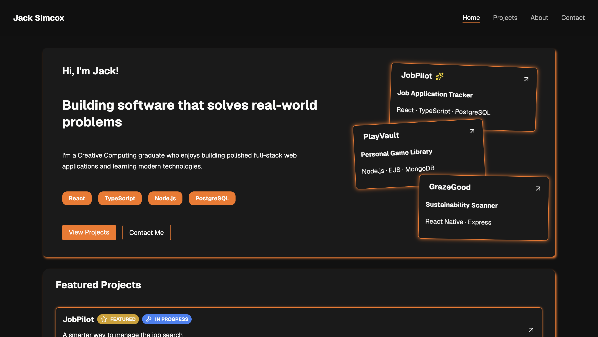

# Developer Portfolio

My personal developer portfolio, built to showcase my projects, technical skills, education, and experience as a full-stack developer.

The portfolio includes detailed case studies for my main projects, covering their features, technologies, technical challenges, lessons learned, and future improvements.

## Screenshot



## Live Site

[View Portfolio](https://portfolio-ten-navy-plza8riyf8.vercel.app/)

## Built With

- Next.js
- React
- TypeScript
- CSS Modules
- Lucide React
- React Icons

## Features

- Fully responsive design across desktop, tablet, and mobile
- Project overview showcasing my main development projects
- Detailed project case studies
- Interactive screenshot carousels
- Technical skills grouped by category
- Education and background information
- Contact links
- Responsive navigation with active route highlighting
- Reusable React components
- Dynamic project pages using project data and slugs

## Featured Projects

### JobPilot

A full-stack job application tracking platform designed to help users organise and manage their job search.

**Technologies:** React, TypeScript, Node.js, Express, PostgreSQL

### PlayVault

A personal game library platform that allows users to discover games and manage their own game collection.

**Technologies:** Node.js, Express, EJS, MongoDB, Mongoose, IGDB API

### GrazeGood

A mobile sustainability scanner that allows users to scan food products and view nutritional and environmental information.

**Technologies:** React Native, Expo, Node.js, Express, MongoDB

Each project has its own case study containing screenshots, key features, technical challenges, lessons learned, and planned improvements.

## Project Structure

```text
app/
├── about/
├── contact/
├── projects/
│   └── [slug]/
├── globals.css
├── layout.tsx
└── page.tsx

components/
├── home/
├── layout/
├── projects/
└── ui/

data/
├── about.ts
└── projects.ts

types/
```

The portfolio uses reusable components alongside centralised project and about data, making it easier to maintain and add new projects in the future.

## Getting Started

Clone the repository:

```bash
git clone https://github.com/450186/portfolio
```

Navigate into the project:

```bash
cd portfolio
```

Install dependencies:

```bash
npm install
```

Start the development server:

```bash
npm run dev
```

Open `http://localhost:3000` in your browser.

## Design

The portfolio uses a dark interface with orange accents and subtle glow effects.

The design focuses on keeping project information easy to scan while providing more detailed case studies for visitors who want to learn about the development process behind each project.

The site was built with responsive layouts for desktop, tablet, and mobile devices.

## Contact

You can find my contact details and professional links on the Contact page of the portfolio.

## Author

**Jack Simcox**

Full-Stack Software Developer
